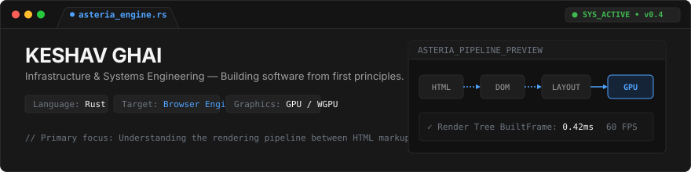
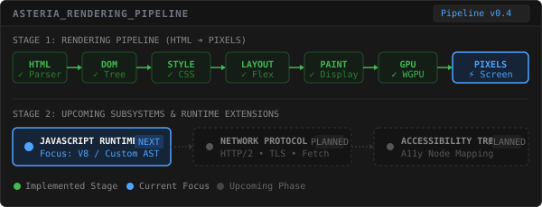
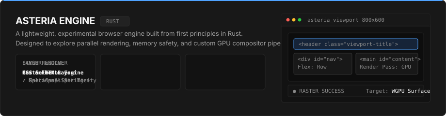
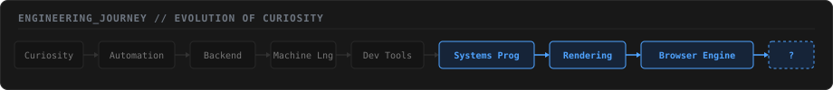

<!-- HERO BANNER -->

  

<!-- DASHBOARD CONTAINER: TWO COLUMN LAYOUT -->
<table width="920" border="0" cellspacing="0" cellpadding="0" style="border-collapse: collapse;">
  <tr>
    <!-- LEFT PANEL: CURRENT BUILD (IDE Sidebar style) -->
    <td width="320" valign="top" style="padding-right: 10px;">
      <table width="100%" border="0" cellspacing="0" cellpadding="0">
        <tr>
          <td style="background-color: #181818; border: 1px solid #2A2A2A; border-radius: 6px; padding: 14px 16px;">
            

              ⚡ CURRENT_BUILD
            

            
             
            
            
PRIMARY PROJECT

            

              Asteria
            

            

              Browser Engine in Rust
            

             

            
CURRENT FOCUS

            

              • Parallel Rendering 
              • Systems Memory Model 
              • WGPU Texture Compositing
            

             

            
LATEST MILESTONE

            

              ✓ Scrolling &amp; Display Lists
            

             

            
NEXT GOAL

            

              🎯 JavaScript AST &amp; Runtime
            

             

            
DOMAINS &amp; STACK

            

              <code>Browser Engines</code> <code>Rust</code> <code>GPU</code> 
              <code>Rendering</code> <code>Systems</code> <code>Architecture</code>
            

          </td>
        </tr>
      </table>
    </td>

    <!-- RIGHT PANEL: RENDERING PIPELINE -->
    <td width="590" valign="top">
      
    </td>
  </tr>
</table>

  

<!-- ASTERIA PRODUCT SHOWCASE -->

  

<!-- BUILD LOG & ENGINEERING MILESTONES -->
<table width="920" border="0" cellspacing="0" cellpadding="0" style="border-collapse: collapse;">
  <tr>
    <td style="background-color: #181818; border: 1px solid #2A2A2A; border-radius: 6px; padding: 16px 20px;">
      

        📋 ASTERIA_BUILD_LOG // RECENT MILESTONES
      

      

      <table width="100%" border="0" cellspacing="0" cellpadding="6">
        <tr style="font-family: 'JetBrains Mono', monospace; font-size: 10px; color: #888888; border-bottom: 1px solid #262626;">
          <th align="left" width="100">VERSION</th>
          <th align="left" width="180">MILESTONE</th>
          <th align="left">TECHNICAL DETAILS</th>
          <th align="right" width="80">STATUS</th>
        </tr>
        <tr style="font-family: 'JetBrains Mono', monospace; font-size: 11px; color: #F5F5F5;">
          <td align="left"><code>v0.4.2</code></td>
          <td align="left">Display List Scrolling</td>
          <td align="left" style="color: #A0A0A0;">Viewport scroll offset &amp; clip rect calculation</td>
          <td align="right" style="color: #3FB950; font-weight: 600;">✓ DONE</td>
        </tr>
        <tr style="font-family: 'JetBrains Mono', monospace; font-size: 11px; color: #F5F5F5;">
          <td align="left"><code>v0.4.0</code></td>
          <td align="left">WGPU Surface Compositor</td>
          <td align="left" style="color: #A0A0A0;">GPU texture backing store &amp; pipeline binding</td>
          <td align="right" style="color: #3FB950; font-weight: 600;">✓ DONE</td>
        </tr>
        <tr style="font-family: 'JetBrains Mono', monospace; font-size: 11px; color: #F5F5F5;">
          <td align="left"><code>v0.3.5</code></td>
          <td align="left">CSS Specificity Engine</td>
          <td align="left" style="color: #A0A0A0;">Cascade sorting &amp; selector matching algorithms</td>
          <td align="right" style="color: #3FB950; font-weight: 600;">✓ DONE</td>
        </tr>
        <tr style="font-family: 'JetBrains Mono', monospace; font-size: 11px; color: #F5F5F5;">
          <td align="left"><code>v0.3.0</code></td>
          <td align="left">Flex Layout Solver</td>
          <td align="left" style="color: #A0A0A0;">Main/cross axis sizing &amp; flex-grow/shrink pass</td>
          <td align="right" style="color: #3FB950; font-weight: 600;">✓ DONE</td>
        </tr>
        <tr style="font-family: 'JetBrains Mono', monospace; font-size: 11px; color: #F5F5F5;">
          <td align="left"><code>v0.5.0</code></td>
          <td align="left">JavaScript Runtime AST</td>
          <td align="left" style="color: #A0A0A0;">Tokenizer &amp; AST execution graph for JS engine</td>
          <td align="right" style="color: #4FA3FF; font-weight: 600;">⚡ WIP</td>
        </tr>
      </table>
    </td>
  </tr>
</table>

  

<!-- ENGINEERING JOURNEY -->

  

<!-- PHILOSOPHY & FOOTER -->
<table width="920" border="0" cellspacing="0" cellpadding="0">
  <tr>
    <td align="center" style="padding: 20px 0 10px 0;">
      <em style="font-family: 'Inter', sans-serif; font-size: 14px; color: #A0A0A0;">"I enjoy understanding the software that everything else depends on."</em>
        
      

        KESHAV GHAI &nbsp;•&nbsp; <a href="https://github.com/Keshav76315" style="color: #4FA3FF; text-decoration: none;">ASTERIA ENGINE</a> &nbsp;•&nbsp; RUST / SYSTEMS
      

    </td>
  </tr>
</table>

